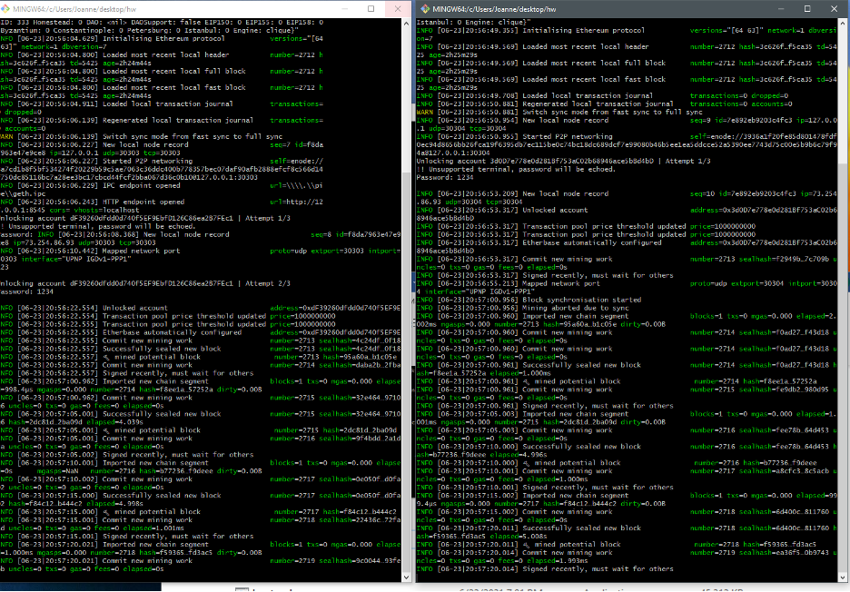
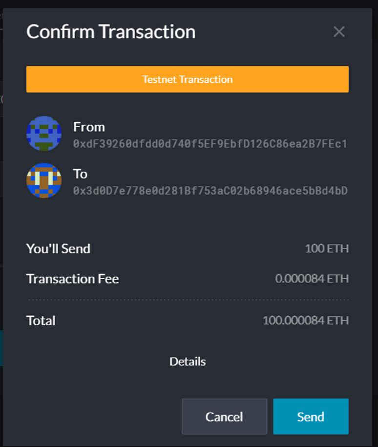

# Proof of Authority Blockchain
The Proof of Authority (PoA) algorithm is typically used for private blockchain networks as it requires pre-approval of, or voting in of, the account addresses that can approve transactions (seal blocks).

Steps to set up the custom testnet blockchain.

## Installing MyCrypto Desktop App
1.	Navigate to the download page at https://download.mycrypto.com/.
2.	Choose the appropriate installer for your operating system.
3.	Finishing download the installer, open the file and follow the installation instruction. 

## Installing Go Ethereum Tools
1.	Navigate to the Go Ethereum Tools download page at https://geth.ethereum.org/downloads/
2.	Scroll down to the "Stable Releases" section.
3.	Download "Geth & Tools 1.9.25".
4.	Decompress the archive found in your "Downloads" folder, and rename the decompressed folder as "Blockchain-hw".

## Navigate to "Blockchain-hw" Folder in Terminal
1.	Navigate to the “download” folder. 
2.	Copy and paste the folder on desktop and rename it to “Balockchain-hw”

## Let’s get start it
1.	Create two nodes for the network by using the following command
* ./geth --datadir node1 account new
* ./geth --datadir node2 account new

Copy and save the Public address of the keys for later use. 

2.	Generate the genesis block by using the command run `./puppeth`
3.	Name your network whatever you'd like and press "Enter": NETWORK_NAME
4.	Choose 2 to pick `Configure new genesis`
5.	Choose 1 to `create new genesis from scratch`
6.	Choose 2 to `clique(proof of Authority)` consensus algorithm.
7.	Paste both account addresses (the public key we saved earlier) .
8.	Paste them again in the list of accounts to pre-fund. There are no block rewards in PoA, so you'll need to pre-fund.
9.	choose no for pre-funding the pre-compiled accounts (0x1 .. 0xff) with wei.
10.	Add Chain ID. It can be any random number. In my case: 333
11.	Choose 2 to `Manage existing genesis`
12.	Choose 2 to `export genesis configurations`
13.	Exit `puppet` by using the `ctrl +C`.
14.	Using geth, initialize each node with the new joannenet.json.

    *./geth --datadir node1 init joannenet.json
    *./geth --datadir node2 init joannenet.json
15.  Now the nodes can be used to begin mining blocks
16.  Run the nodes in separate gitbash window with the following command

 
17. Now, the private POA blockchain should now be running!
 

# Testing the blocks 
1.	With both nodes up and running, the blockchain can be added to MyCrypto for testing.
2.	Open MyCrypto
3.	Select “Change Network”
4.	Input network names as “Node Name”
5.	Select “custom” in the “Network” dropdown.
6.	Input “joannenet” name as “Network Name”
7.	Select “ETH” for Currency
8.	Input chain ID, my case 333.
9.	Input "https://127.0.0.1:8545/" as the "URL"
10.	Select and “save & use Custom Node”. 

Note: I am start have problems click "save&use custome node"

## Send transactions
1. Select the “View & Send” option then click Keystore file
2.click Select Wallet File, then navigate to the keystore directory inside your Node1 directory, select the file located there, provide your password when prompted and then click Unlock.
3.	Open the account wallet. 
4.	Input the address you want to send money to as the "To Address". This is the account address for node 2. 
5.	Input your desired amount of currency.
6.	Click “Send”

## Check Transactions
1.	Open MyCrypto.
2.	Select "TX Status".
3.	Input your TX Hash.
4.	Select "Check TX Status".

Note: Becasue I coulnd't save the custom node from MyCrpto. I wasn't able to have a scuccesful transaction. It should be showing succesful transaction below. 

