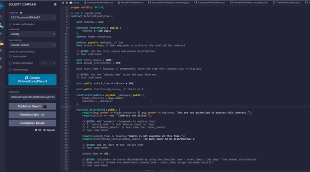
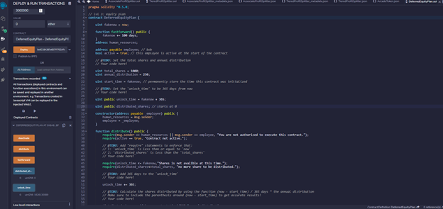

# Level three: DeferredEquityPlan Contract

This contract we will help HR to distribute 1000 shares over 4 years to employee. Each year only 250shares (1000/4) will be stributed to and owned by employee each year. If the employee decide to quit on the 3rd year, the remiaining 500 shares will stay with the company. 

## Compile the contract 

## Deploy the contract

