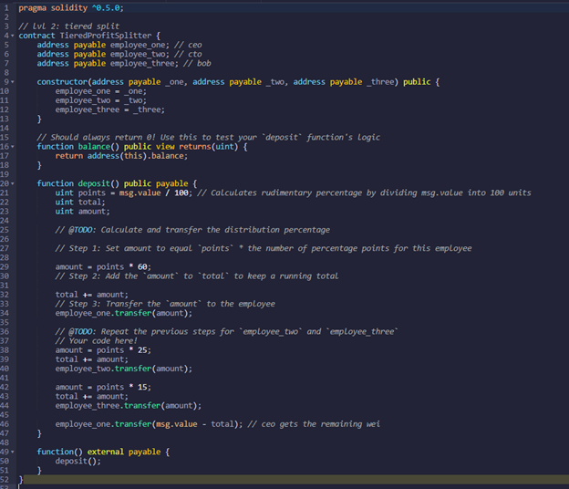
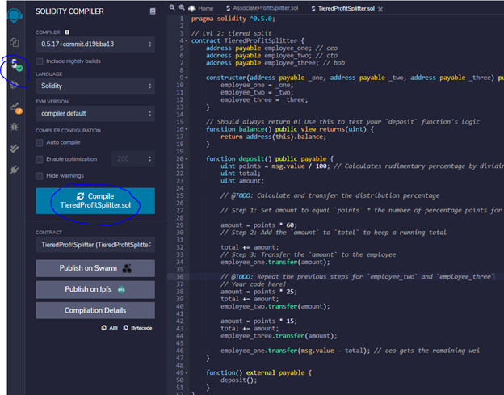
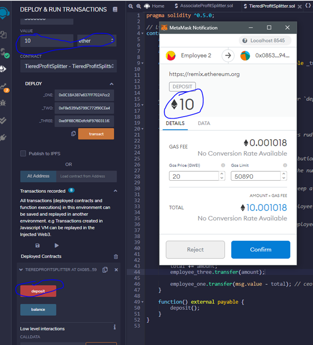
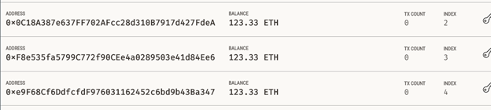
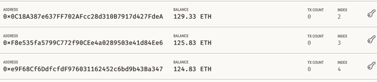

# Level two: TieredProfitSpritter Contract

This contract we will help HR to pay employees by their title. CEO will get 60%, CTO will get 25% and Bob will get 15% of the profit.   The contract will be written in Remix IDE and uning Ganache and MetaMask(localholst:8545) to show the transactions.

## Smart contract code written in Remix 

## Compile the contract 

## Deploy the contract and depsosit 10 Ethers among employee by their title CEO(60%), CTO(25%) and Bob(15%). 

## Original account banlances shown in Ganache.

## Account balances after the deposit. CEO got 6Ether, CTO got 2.5Ether and Bob got 1.5Ether for bonus. 
