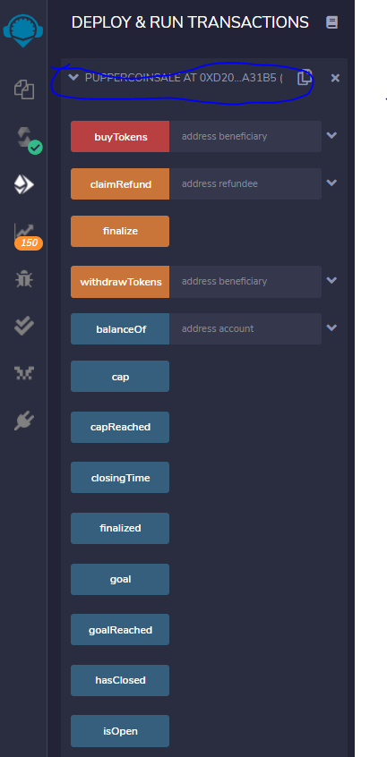

# HW 21 - Advanced Solidity- In this homework, I will create a ERC 20 token that minted through Crowsale contact. I am useing OpenZepppelin Solidity library to leverage the contract. I am using the two starter codes: Crowesdale.sol and PupperCoin.sol. 

## Smart contract code written in Remix 

## Compile the contract 

## Deploy the contract. 

    1.Change the enviroment to Injected Web3.
    2.Connect to Metamask (connct to one of the Ganache account,I have the banlance of 87.92 ethers).
    3.Click on Contract and choose "PupperCoinSaleDeployer-PupperCoin".
    4.Click on Deploy dropdown and fill in the name, Symbol, wallet and Goal(300ether in wei). then click the transact. 
    5.Open the deployed Contracts (Puppercoinsaledeployer) Copy the token_sale_address and paste it to PupperCoinSale - PuperCoinCrowdsale.osl contract "add address"copy
    6.Copy the token_address and paste it to PupperCoin-PupperCoin.sol contract "add address".
    

   

     

## Using 10 Ether to buy 10 Puppcoin

## My account balance is dropped from 87.92 down to 77.73 Ether 

